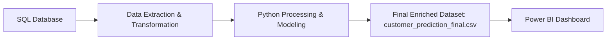

# 📊 Customer Subscription & Retention Analytics

## 🔹 Project Overview

This project is an **end-to-end data analytics pipeline** designed to analyze magazine subscription data and provide actionable insights into **customer churn, retention, and engagement**.

The pipeline integrates **SQL, Python, and Power BI** to cover the complete data lifecycle — from raw data to predictive modeling and finally business-ready dashboards.

---

## 🔹 Pipeline Architecture



---

## 🔹 Workflow

1. **Data Storage & Extraction (SQL)**

   * Raw customer & subscription data stored in SQL tables
   * SQL queries used for joins, aggregations, and filtering

2. **Data Processing & Modeling (Python)**

   * Cleaned & transformed data with **Pandas & NumPy**
   * Built **churn prediction models** (Logistic Regression, Random Forest)
   * Applied **KMeans clustering + PCA** for customer segmentation & engagement scoring
   * Exported **final enriched dataset** → `customer_prediction_final.csv`

3. **Business Intelligence (Power BI)**

   * Imported `customer_prediction_final.csv` into Power BI
   * Designed dashboards with key insights:

     * **KPIs** → Total Customers, Revenue, Active vs Expired, Churn %
     * **Subscription Funnel** → Active → Expired → Churned
     * **Churn Analysis** → Probability distribution, demographics, segment impact
     * **Segmentation** → Radar chart profiling, segment sizes, segment vs magazine preference
     * **Engagement** → Avg session time, subscription length, PCA-based engagement index

---

## 🔹 Tech Stack

* **SQL** → Data extraction & preprocessing
* **Python** → Pandas, NumPy, Scikit-learn (ML models), Matplotlib/Seaborn (EDA)
* **Power BI** → Interactive dashboards & visualization
* **GitHub** → Version control & documentation

---

## 🔹 Getting Started / Setup

Follow these steps to reproduce the project:

1. **Clone this repository**

   ```bash
   git clone https://github.com/your-username/customer-subscription-analytics.git
   cd customer-subscription-analytics
   ```

2. **Run SQL Scripts**

   * Navigate to `/sql` folder
   * Execute queries in your SQL environment to extract & preprocess raw data

3. **Run Python Scripts/Notebooks**

   * Navigate to `/python` folder
   * Install required libraries:

     ```bash
     pip install -r requirements.txt
     ```
   * Run scripts to clean data, run ML models, and generate final dataset

4. **Locate Final Dataset**

   * The enriched dataset will be saved as:

     ```
     /data/customer_prediction_final.csv
     ```

5. **Open Power BI Dashboard**

   * Import `customer_prediction_final.csv` into Power BI
   * Open the PBIX file from `/powerbi` to view dashboards

---

## 📂 Repository Structure

```
├── sql/                          # SQL queries for data extraction & joins
├── python/                       # Python notebooks & scripts (EDA, ML, segmentation)
├── data/                         
│   └── customer_prediction_final.csv   # Final dataset used in Power BI
├── powerbi/                       # PBIX file for dashboards
├── images/                        # Screenshots of dashboards
└── README.md
```

---

## 🔹 Business Value

* Identifies **at-risk customers** with churn probability scores
* Provides **customer segmentation** for personalized campaigns
* Monitors **revenue, retention, and engagement** in real-time
* Helps business teams make **data-driven decisions** to reduce churn

---

✨ This project demonstrates how to integrate **SQL + Python + Power BI** into a seamless analytics workflow for real-world customer subscription insights.

---
